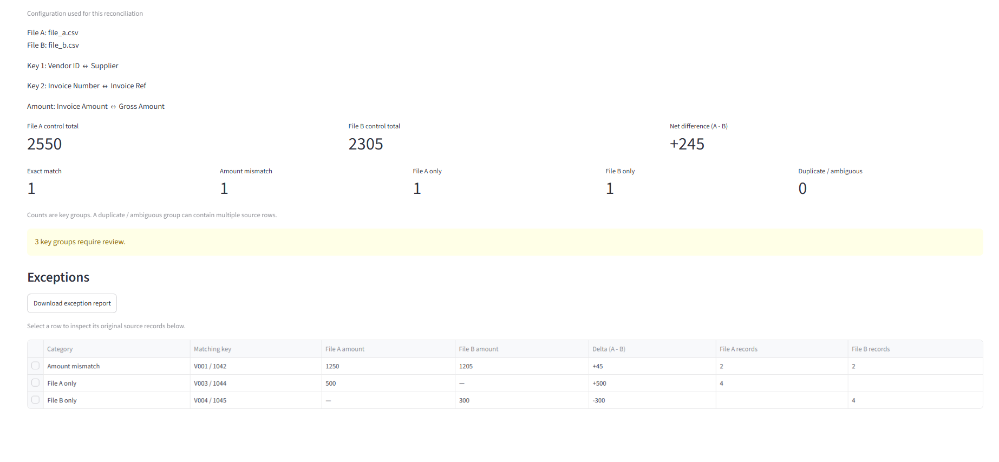

# TallyDiff

TallyDiff compares two financial CSV exports and explains which records account
for their difference. Use an ordered key, such as vendor plus invoice number, to
review unequal amounts, missing records, and duplicate keys with their original
source evidence.



**v0.1.0** is the stable compatibility baseline. The **v0.2 development branch**
adds an optional global absolute amount tolerance to the local Streamlit app:
upload two files, map their columns, reconcile, inspect findings, and download
a CSV exception report. Every source record is accounted for, ambiguous
duplicates stay visible, and all finding deltas explain the control-total
difference. Equal totals alone never imply a reconciliation.
TallyDiff reports differences; it does not decide which source is authoritative.

## Quick start

Requirements: Python **3.12+** and [uv](https://docs.astral.sh/uv/).
Clone this repository, then run these commands from its root:

```bash
uv sync --locked
uv run streamlit run src/tallydiff/app.py
```

Open <http://127.0.0.1:8501>. The tracked `.streamlit/config.toml` binds the server
to the local machine and disables Streamlit usage telemetry. TallyDiff does not
send uploaded data to external services, cache it globally, or save it to disk.
Files and results are held in the local session; downloaded reports are saved
where you choose. Installing dependencies requires network access initially.

## Sample workflow

The files in `sample_data/` contain only synthetic records.

1. Upload `sample_data/file_a.csv` as **File A** and `sample_data/file_b.csv` as
   **File B**. The app displays each filename and validated column names.
2. Choose the mappings below. Use **+ Add key field** for the second key pair.
   Every selector starts empty; the app does not infer mappings.

   | Selection | File A | File B |
   | --- | --- | --- |
   | Key field 1 | Vendor ID | Supplier |
   | Key field 2 | Invoice Number | Invoice Ref |
   | Amount | Invoice Amount | Gross Amount |

3. Leave **Amount tolerance** at its default `0`, then click **Run reconciliation**.
   Expect File A total **2550**, File B total **2305**, and net difference **+245**. The four key groups are:

   | Matching key | Category | Delta (A - B) |
   | --- | --- | --- |
   | V001 / 1042 | Amount mismatch | +45 |
   | V002 / 1043 | Exact match | 0 |
   | V003 / 1044 | File A only | +500 |
   | V004 / 1045 | File B only | -300 |

4. Select **V001 / 1042** in the exception table. Both evidence panels show
   source record **2**, including the original amounts **1250** and **1205**.
5. Click **Download exception report**. The CSV contains exactly the three
   exception groups above, with blank amounts for the missing sides.

The pair order defines the composite key. Incomplete mappings or repeated key
column selections disable reconciliation. A changed file resets mappings; any
file, mapping, or tolerance change clears the result and download until you run
again. Selecting an exception or accepted variance preserves the current result.

## Absolute amount tolerance

**Amount tolerance** accepts ordinary monetary text in the same units as the
selected amount columns. It defaults to `0`, preserving v0.1 exact-match behavior.
Negative, blank, malformed, and non-finite values block reconciliation. The
existing monetary grammar is used directly to construct a Decimal; no float
conversion or rounding occurs, and more than two decimal places are supported.

Tolerance applies only to a key with exactly one record on each side. Exact
equality remains **Exact match**. A nonzero difference is **Within tolerance**
when `abs(A - B) <= tolerance` (inclusive); larger differences are **Amount
mismatch**. At tolerance `0.01`, `100.00` versus `100.01` is within tolerance with
a true delta of `-0.01`; `100.00` versus `100.02` remains an amount mismatch.
One-sided records and duplicate / ambiguous groups always require review.

Within-tolerance findings are accepted variances, excluded from ordinary
exceptions and their CSV report. The summary shows the tolerance used and the
Within tolerance group count. A separate **Within tolerance** table retains both
amounts, the actual delta, and selectable original source evidence. Its **Net
accepted variance (A - B)** is a signed sum: opposing deltas can cancel, while
the count and individual rows still expose every accepted difference.

With only exact matches and accepted differences, the app says **Reconciled
within configured tolerance**. The control totals and net difference always
include all true deltas; tolerance never zeroes, rounds, or hides arithmetic.

## Supported inputs

- Two comma-delimited CSV files with headers, encoded as UTF-8 with an optional
  BOM. Header names and selections are exact. Header-only files are valid.
- One or more explicitly paired key columns in the same logical order, and one
  amount column per file. Matching trims surrounding key whitespace only;
  leading zeroes, case, punctuation, and internal whitespace remain significant.
- U.S.-style amounts such as `1200.00`, `1,200.00`, `$1,200.00`, `-1200.00`, and
  `(1,200.00)`. Quote CSV fields containing commas. All decimal places are retained.
- Invalid encoding, malformed CSV, missing fields, blank keys, invalid headers,
  or invalid amounts block the run with file/record/column context where available.
  Header discovery checks only the header; reconciliation validates every record.

See the [monetary grammar](#monetary-text-grammar) for the full accepted syntax.

## Correctness and traceability

| Category | Meaning |
| --- | --- |
| Exact match | One record on each side with equal amounts. |
| Within tolerance | One record on each side with a nonzero absolute delta at or below tolerance. |
| Amount mismatch | One record on each side with an absolute delta above tolerance. |
| File A only | One File A record and no File B record. |
| File B only | One File B record and no File A record. |
| Duplicate / ambiguous | More than one record on either side; all records need review. |

Duplicates take precedence over the other categories. They are never silently
paired or discarded, even when their aggregate amounts agree or offset to zero.
Counts represent key groups, while the evidence panels retain every source row.
A missing side shows an em dash in the table and a blank amount in the export;
a present zero-dollar record shows its actual Decimal amount, such as `0.00`.

The engine checks both row accounting and this invariant on every run:

```text
File A control total - File B control total = sum of all finding deltas
```

Amounts are parsed and calculated using `Decimal`, without floats, rounding,
or quantization. Tolerance changes classification only. Findings are sorted by
key, and evidence by source record number. Raw field values are preserved in immutable snapshots. The CSV
header is record **1**, and the first data record is **2**; a quoted multiline
field is still part of one record, so these are not necessarily physical line numbers.

## Exception report

**Download exception report** saves `tallydiff_exceptions.csv` for the currently
displayed reconciliation. There is one row per exception key group, including
zero-delta ambiguous groups. Exact matches and accepted within-tolerance findings
are excluded; the UI offers no exception download when there are no exceptions.
When accepted variance exists, exception-report deltas alone need not equal the
control difference: add the net accepted variance shown in the UI.

Columns, in order: `Category`, `Matching key`, `File A amount`, `File B amount`,
`Delta (A - B)`, `File A records`, `File B records`. Matching key components use
` / `, as in the table. Amounts and signed deltas retain the application's exact
Decimal text. Missing-side amounts are blank; a present `0.00` remains `0.00`.

Each side lists **all** participating source record numbers, separated by `; `,
including every duplicate. Keep the original CSV files and the configuration
shown in the UI: those references provide traceability without duplicating every
raw field in the report. The joined key is a display label, not a serialization
for reconstructing composite keys that themselves contain ` / `.

Output is comma-delimited UTF-8 CSV without a BOM, with CRLF record endings and
standard quoting for commas, quotes, and embedded newlines. The UI-independent
`export_exceptions_csv(result)` API returns bytes; a result with no exceptions
produces a header-only CSV.

**Spreadsheet safety:** matching-key text is exported as displayed, without
adding an apostrophe or tab prefix. Such prefixes would change identifiers for
downstream CSV consumers. This preserves traceability but means the report is
**not sanitized for spreadsheet formula execution**. Formula-like keys, including
values starting with `=`, `+`, `-`, or `@`, can be interpreted as formulas by a
spreadsheet; CSV quoting alone does not prevent this. Control characters and
locale-specific variants can also matter. See [OWASP's CSV injection guidance](https://community.owasp.org/attacks/CSV_Injection).

Do not open untrusted reports by double-clicking them in a spreadsheet. Use a CSV
reader, or import every column as text with formula evaluation disabled. Text
import also avoids losing leading zeroes or rounding long monetary values in the
spreadsheet. Numeric amount/delta cells are never prefixed or otherwise rewritten.

## Architecture

| Module | Responsibility |
| --- | --- |
| `_decimal.py` | Exact addition isolated from the caller's Decimal context. |
| `amounts.py` | Strict monetary text parsing directly to Decimal. |
| `models.py` | Validated source records, immutable evidence, findings and totals. |
| `engine.py` | Exact grouping, classification, deterministic ordering and integrity checks. |
| `ingest.py` | Header discovery and atomic CSV validation with explicit mappings. |
| `presentation.py` | UTF-8 decoding, mapping validation, configuration identity and display strings. |
| `export.py` | Ordinary CSV bytes, reusing UI-independent labels and Decimal formatting. |
| `app.py` | Streamlit controls, error messages, results, download and source evidence. |

Public Python APIs are exposed through `tallydiff`. The engine and export layer
have no Streamlit dependency. The UI performs no financial calculations.
Results carry a SHA-256 identity covering file contents, filenames, ordered key
pairs, amount selections, and the exact Decimal tolerance; each rerun checks it
before showing results or a download. Expected validation failures are shown explicitly; unexpected errors
are not broadly swallowed.

## Development and verification

```bash
uv sync --locked
uv run pytest
uv run ruff check .
uv run ruff format --check .
uv build
```

`uv.lock` pins runtime and development dependencies; `--locked` rejects a stale
lockfile. Streamlit is the runtime dependency; pytest and Ruff are development
dependencies. `uv build` uses Hatchling to build a source distribution and wheel
in the ignored `dist/` directory. The documented app workflow uses the repository
checkout, which includes the local Streamlit configuration and synthetic samples.

[CI](.github/workflows/ci.yml) runs these gates on every push and pull request
using Python **3.12** (the minimum) and **3.14**. It starts from a clean checkout,
installs locked dependencies without restoring an environment cache, and builds
both package formats. Actions are pinned to commits; uv is pinned to **0.12.23**.
There is no deployment or publishing step.

Tests cover row accounting and control-total invariants, duplicate cardinalities,
Decimal precision and context isolation, invalid monetary text, CSV validation,
encoding, mappings, missing versus zero amounts, evidence and export read-back.
Streamlit [AppTest](https://docs.streamlit.io/develop/api-reference/app-testing/st.testing.v1.apptest)
exercises uploads, mappings, the sample workflow, source evidence, error states,
download visibility, and stale-result invalidation. Tolerance tests cover inclusive
boundaries, high precision, invalid types and values, duplicate and one-sided
precedence, accepted variance totals, separate review, and export exclusion.

## Python API contracts

### Reconciliation kernel

`reconcile(records_a, records_b, *, amount_tolerance=Decimal("0"))` preserves the
v0.1 classifications when tolerance is omitted or zero. Tolerance must be a
finite, nonnegative `Decimal`; other types raise `TypeError`, and non-finite or
negative Decimals raise `ValueError`. No numeric coercion is performed.

`ReconciliationResult.amount_tolerance` records the configured value.
`result.tolerated_findings` contains accepted nonzero differences, and
`result.tolerated_delta_total` is their exact signed net delta.
`finding.is_exception` and `result.exceptions` exclude exact and within-tolerance
groups. `result.findings`, control totals, and the integrity invariant include
every group, including accepted variances.

- Inputs are already-parsed `SourceRecord` objects. Amounts must be finite `Decimal`
  values; floats, other numeric types, NaN, and infinity are rejected.
- Each row has a `Source` enum member, a positive integer source row number, and a
  nonempty tuple of nonblank strings as its key. Row numbers must be unique within
  each file; the same row number may appear in both files.
- Keys are compared exactly, without trimming or case conversion. Raw fields are
  preserved in an immutable copy for traceability.
- Every input row appears in exactly one finding. Multiple rows on either side of
  a key produce one ambiguous group containing all rows, even with equal totals.
- Findings are sorted by key, and rows within each finding by source row number.
  Inputs are snapshotted once, including one-pass iterables.
- Totals and deltas use exact Decimal arithmetic isolated from the caller's Decimal
  context. No rounding or quantization is applied; tolerance affects classification only.

### CSV ingestion

`inspect_csv_columns(data, source=...)` returns validated column names in their
original order, without requiring mappings or validating data records. It shares
header validation with `ingest_csv`. For text streams, inspection consumes the
header; rewind the stream or provide the original text before ingestion.

`ingest_csv` accepts decoded CSV text or an open text file-like object, plus an
explicit `Source`, ordered key column names, and an amount column name. It returns
an immutable tuple of validated `SourceRecord` objects only after the entire input
passes validation. No rows are returned on failure.

```python
from tallydiff import Source, ingest_csv, reconcile

records_a = ingest_csv(
    "vendor,invoice,amount\nV001,001042,1250.00\n",
    source=Source.A,
    key_columns=["vendor", "invoice"],
    amount_column="amount",
)
records_b = ingest_csv(
    "vendor,invoice,amount\nV001,001042,1205.00\n",
    source=Source.B,
    key_columns=["vendor", "invoice"],
    amount_column="amount",
)
result = reconcile(records_a, records_b)  # control difference: Decimal("45.00")
```

- CSV uses commas, double-quoted fields, and doubled double quotes for escaping.
  Fields containing commas or newlines must be quoted.
- The header is source record **1**; the first data record is **2**. A quoted field
  spanning physical lines is still part of one CSV record. `source_row` is a
  record ordinal, not necessarily a physical line number.
- Header names and column selections are exact, including case and surrounding
  whitespace. Missing headers, blank names, duplicate names (including unselected
  columns), and missing selected columns block ingestion. No mappings are guessed.
- Key values are strings, with only surrounding whitespace trimmed for matching.
  Leading zeroes, case, punctuation, and internal whitespace are preserved.
  Blank required key components block ingestion.
- `raw_fields` preserves every original field value as parsed by `csv`, including
  whitespace and embedded line endings. CSV quoting is decoded; stored evidence
  is never trimmed to match the normalized key.
- Blank records, extra or missing fields, malformed quoting, invalid amounts,
  and text read/decoding errors block ingestion. A valid header with no data
  produces an empty tuple. Duplicate **data keys** are retained for the engine
  to report as ambiguous groups.
- Caller-owned streams are consumed from their current position and never closed.
  Open files with `newline=""` and an explicit encoding. For UTF-8 files with an
  optional byte-order mark, use `encoding="utf-8-sig"`; ingestion does not infer
  encodings or remove a byte-order mark from already-decoded text.

`IngestionError` exposes `source`, `source_row`, `column`, `value`, and `reason`
when applicable. Display `str(error)` for a concise diagnostic instead of a
traceback. Ingestion stops at the first error; it does not return partial results.

### Monetary text grammar

`parse_amount` constructs `Decimal` directly from validated source text. There is
no float conversion, quantization, tolerance, currency conversion, or automatic
sign inversion. All fractional digits and trailing fractional zeroes are retained.

Supported forms include:

- plain amounts: `1200`, `1200.00`, `0`, `0.00`, `.125`, `1200.`;
- groups of three thousands digits: `1,200.00`, `1,234,567.8901`;
- an optional dollar prefix: `$1,200.00`;
- a leading sign before any dollar prefix: `-1200.00`, `-$1,200.00`, `+$1,200.00`;
- accounting negatives: `(1,200.00)`, `($1,200.00)`.

Only whitespace surrounding the entire value is ignored. The grammar uses ASCII
digits, comma thousands separators, and a period decimal separator. Parentheses
cannot be combined with an explicit sign. Blank amounts, malformed commas,
non-finite values, internal whitespace, other currency symbols, decimal-comma
locales, trailing signs, underscores, and scientific notation are rejected with
`AmountParseError` (wrapped in `IngestionError` with CSV record and column context
when ingesting CSV). No malformed amount is converted to zero.

## Known limitations

- CSV only, UTF-8 input, two files at a time, one amount field per file, and
  U.S.-style monetary syntax. No Excel ingestion or export, locale inference,
  currency conversion, or automatic sign correction.
- Exact keys after surrounding-whitespace trimming and one global absolute amount
  tolerance. No percentage or per-row tolerance, fuzzy matching, automatic
  mappings, or decisions about the authoritative source.
- No saved configurations, database, reconciliation history, accounting-system
  integrations, authentication, or cloud service. The app is intended to run
  locally from the repository root, not as a shared hosted service.
- Inputs, evidence, and report bytes are held in memory. There is no streaming
  ingestion or large-file performance guarantee.
- CSV does not carry spreadsheet cell types. Reports retain raw key text and
  exact numeric strings; follow the spreadsheet-safety guidance above.

No real or confidential financial data should be committed to this repository.
No software license has been selected; a LICENSE decision remains with the owner.
